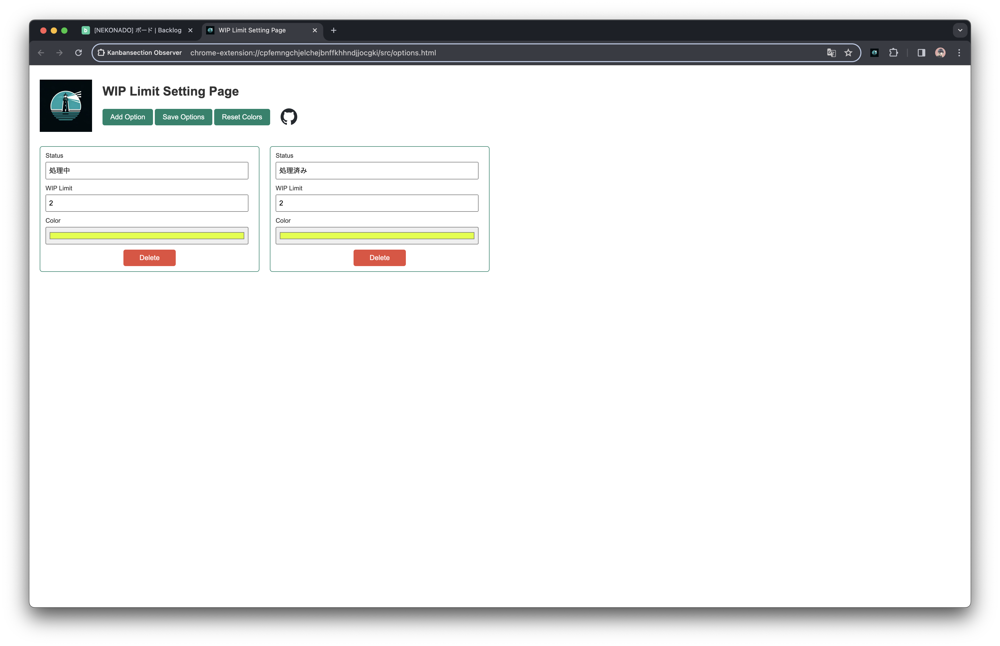

  

[ English | [日本語](https://github.com/nekonado/kanbansection-observer/blob/main/README.md) ]

---

# Kanbansection Observer

Kanbansection Observer is a Chrome extension designed to enhance the usability of kanban boards on [Backlog (Nulab Inc.)](https://backlog.com/ja/). It observes each section of your kanban board, highlighting those that exceed Work In Progress (WIP) limits. Additionally, it offers an options page for customizing the WIP limits and highlight colors for each status.

## Features

- **Custom Styling**

  Highlights sections exceeding WIP limits, allowing you to visually track project progress.
  

- **Options Page**

  Provides an options page where you can customize WIP limit numbers for each status and the colors used for highlighting.
  

## Installation

Please install from the [Chrome Web Store](https://chromewebstore.google.com/detail/kanbansection-observer/mpdokkleihjigkcikbibmimekikdpmam). If you wish to use the latest version not yet published to the Web Store, follow the manual installation instructions below.

### Manual Installation Instructions

1. Clone the repository to any directory.
2. Open Google Chrome and navigate to [chrome://extensions/](chrome://extensions/).
3. Enable "Developer mode" in the top right corner.
4. Click "Load unpacked extension" and select the directory where you cloned the repository.

## How to Use

After installing Kanbansection Observer, visit your Backlog project page, then open the options page to customize it. Once customization is complete, sections of your kanban board that exceed the WIP limits will be highlighted. For detailed instructions, refer to the demo video below.

👉 [Watch the demo video](https://www.youtube.com/watch?v=Jj5IasT99XY)

## How to Contribute

Contributions are welcome! If you encounter any issues or have suggestions for improvements, please open an issue or submit a pull request on the [GitHub repository](https://github.com/nekonado/kanbansection-observer).

## License

This project is provided under the MIT License. For details, see the [LICENSE file](https://github.com/nekonado/kanbansection-observer/blob/main/LICENSE).

---

🥚🥚🥚🥚🥚

### 🐣 Easter Egg: The Secret Behind "Kanbansection Observer" 🐣

If you've opened this section, perhaps you're in search of something special? Congratulations, you've discovered a little secret! Did the name "Kanbansection Observer" ring any bells? Yes, it's a playful combination with the "Intersection Observer API".

The joke here adds a bit of irony to the fact that this extension doesn't actually use the Intersection Observer API (it's implemented using the Mutation Observer API instead).

But that's not all. For those who've found this easter egg, here's another secret: developing this extension wasn't just about improving work efficiency. We aim to bring more light not only to your kanban boards but to your daily tasks as well.

So, if this little joke added some fun to your day, we're glad. And if this extension enhances your experience with kanban boards, please share it with friends! The developer, [@nekonado](https://github.com/nekonado), looks forward to your feedback!

