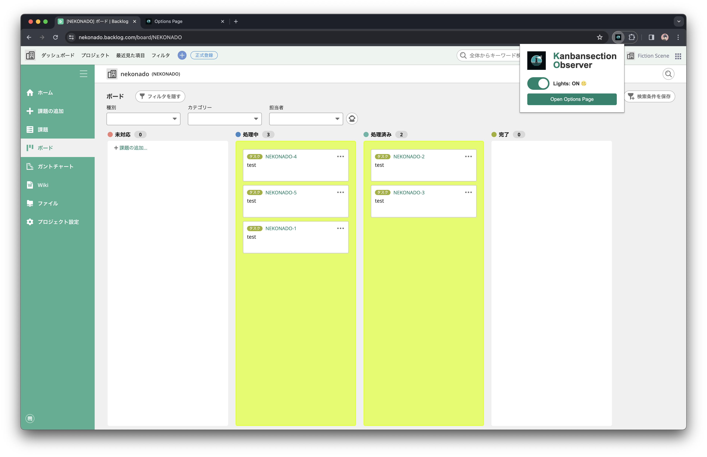
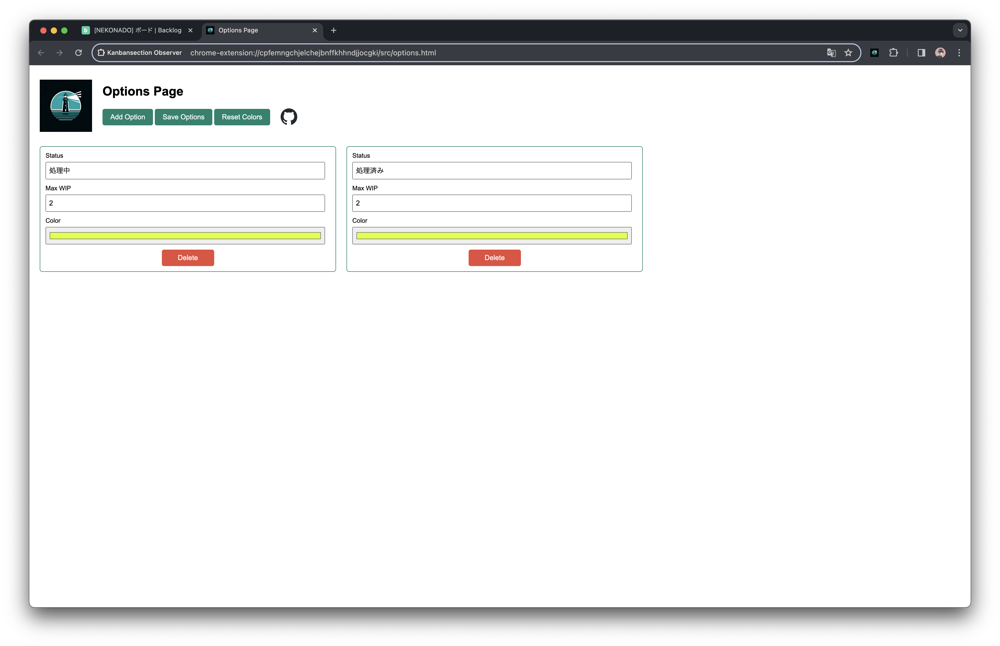

<p align="center">
  <a href="https://github.com/nekonado/kanbansection-observer">
    
  </a>
</p>


---

# Kanbansection Observer

Kanbansection Observer は、[Backlog (Nulab Inc.)](https://backlog.com/ja/) のカンバンボードの利便性を向上させるための Chrome 拡張機能です。この拡張機能は、カンバンボードの各セクションを観察し、WIP 制限を超えたセクションを強調表示します。また、オプションページを提供し、状態ごとの WIP リミット数の個別設定や強調表示の色をカスタマイズすることができます。

## 機能

- **カスタムスタイリング**

  WIP 制限を超えたセクションを強調表示し、プロジェクトの進行状況を視覚的に把握します。
  

- **オプションページ**

  状態ごとの WIP リミット数、強調表示の色についてカスタマイズできるオプションページを提供します。
  

## インストール

[Chrome ウェブストア](https://chromewebstore.google.com/detail/kanbansection-observer/mpdokkleihjigkcikbibmimekikdpmam)からインストールしてください。ウェブストアに未公開の最新バージョンを使用したい場合は、以下の手順に従って手動でインストールしてください。

### 手動インストール手順

1. 任意のディレクトリにリポジトリをクローンします。

   ```bash
   git clone https://github.com/nekonado/kanbansection-observer.git
   ```

2. Google Chrome を開いて、[chrome://extensions/](chrome://extensions/) に移動します。
3. 右上隅にある「開発者モード」を有効にします。
4. 「パッケージ化されていない拡張機能を読み込む」をクリックし、リポジトリをクローンしたディレクトリを選択します。

## 使用方法

Kanbansection Observer をインストールして、Backlog プロジェクトページにアクセスした後、オプションページを開いてカスタマイズをします。カスタマイズが完了したら、カンバンボードの各状態セクションに対して、WIP 制限を超えたセクションが強調表示されるようになります。具体的な操作方法については、以下のデモ動画を参照してください。

👉 [デモ動画を見る](https://www.youtube.com/watch?v=Jj5IasT99XY)

## 貢献方法

貢献は歓迎されています！問題が発生した場合や改善提案がある場合は、[GitHub リポジトリ](https://github.com/nekonado/kanbansection-observer)で Issue を開いたり、プルリクエストを送信したりしてください。

## ライセンス

このプロジェクトは MIT ライセンスの下で提供されています。詳細については、[LICENSE ファイル](https://github.com/nekonado/kanbansection-observer/blob/main/LICENSE)を参照してください。

---

<details>
<summary>🥚🥚🥚🥚🥚</summary>

### 🐣 イースターエッグ: 「Kanbansection Observer」の秘密 🐣

あなたがこのセクションを開いたということは、もしかして何か特別なものを探しているのかな？おめでとう、小さな秘密を見つけたよ！「Kanbansection Observer」という名前、聞いてピンと来た？そう、あの「Intersection Observer API」とのちょっとした掛け合わせだ。

ここでの小さなジョークは、この拡張機能が実際には Intersection Observer API を使っていないという事実にちょっとした皮肉を加えているんだ（実際には Mutation Observer API を使って実装しているよ）。

でも、それだけじゃない。このイースターエッグを見つけたあなたには、もう一つ秘密を教えよう。実は、この拡張機能を開発した理由は、ただ単に仕事の効率を上げるためだけではなかった。私たちは、カンバンボードだけでなく、あなたの日々の業務にも、もっと光をもたらしたいと思っているんだ。

だから、この小さなジョークが、あなたの一日にちょっとした楽しさを加えることができたら嬉しいな。もし、この拡張機能があなたのカンバンボードの利用体験を向上させたなら、ぜひ友達にも教えてあげてね！開発者の[@nekonado](https://github.com/nekonado)も、あなたからのフィードバックを楽しみにしています！

...以上、アメリカ映画の吹き替えっぽい文章でした。

</details>
